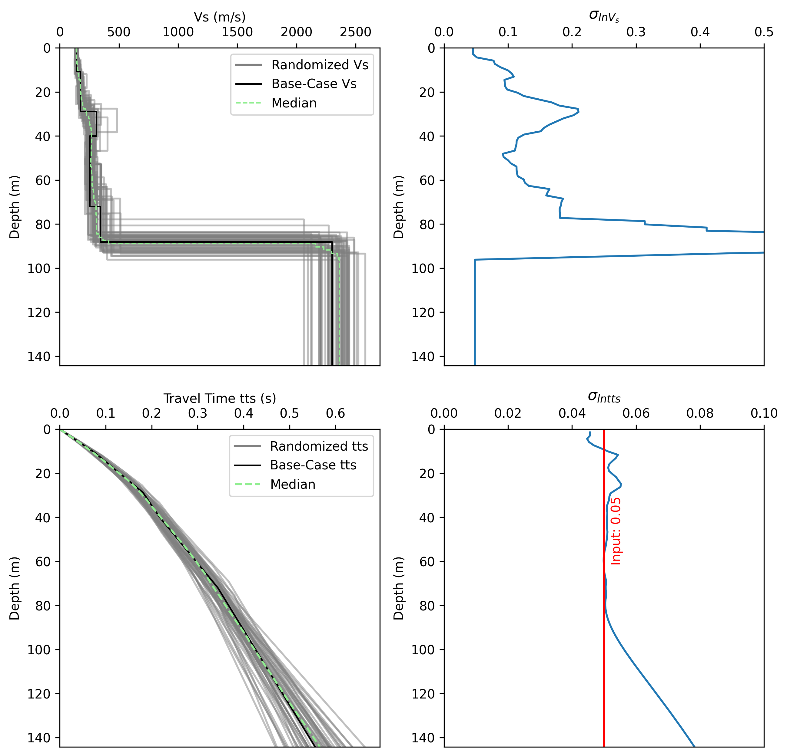

# Travel time randomization to account Spatial Variability in 1D Ground Response Analysis

This project uses the Travel Time Randomization method to create N profiles for Spatial Variability analysis, based on the paper by Prof. Mohamad Hallal et al. [[1]](#1).

## Requirements

- Python 3.8 or higher
- Required Python packages: numpy, pandas

## Input 
The code requires a CSV file with the data of Vs and Depth of top of each layer. The code currently uses S.I. units.

- CSV file with Depth and Vs values (in S.I. Units)

## Output
The code is currently exporting a CSV file with the randomized number of profiles and an output for the selected 1D GRA analysis software used.

## Usage

1. Clone the repository
2. Install the required packages
3. Run the main script with your input CSV file

## References
<a id="1">[1]</a> 
Mohamad M. Hallal, Brady R. Cox, Sebastiano Foti, Adrian Rodriguez-Marek, Ellen M. Rathje,
Improved implementation of travel time randomization for incorporating Vs uncertainty in seismic ground response,
Soil Dynamics and Earthquake Engineering,
Volume 157,
2022,
107277,
ISSN 0267-7261,
https://doi.org/10.1016/j.soildyn.2022.107277.

